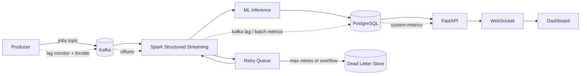

# Fake Job Detector (Production Pipeline)

This project runs a real-time fake-job detection pipeline:

Producer -> Kafka -> Spark Structured Streaming -> ML Inference -> PostgreSQL -> FastAPI -> WebSocket -> Next.js Dashboard

No simulated/demo data path is required for normal operation.

## Folder Structure

- `api/app.py`: FastAPI backend, health/status/read endpoints, websocket broadcasting.
- `kafka/producer.py`: Real producer that publishes normalized job events to Kafka topic `jobs`.
- `spark/spark_stream.py`: Spark Structured Streaming consumer from `jobs`, ML scoring, PostgreSQL persistence, optional `processed_jobs` output topic.
- `spark/stream_processor.py`: Backward-compatible wrapper to `spark_stream.py`.
- `utils/db_writer.py`: PostgreSQL schema and insert helpers.
- `dashboard/`: Next.js real-time dashboard consuming FastAPI endpoints + websocket updates.
- `run_spark_stream.ps1`: Windows Spark launcher with Java/Hadoop guardrails.
- `../start_system.py`: Full stack orchestrator for PostgreSQL + Kafka + Spark + API + dashboard.

## Runtime Architecture



1. `kafka/producer.py` publishes events to Kafka topic `jobs` with fields:
   - `id`, `title`, `description`, `company`, `timestamp`
2. `spark/spark_stream.py` consumes `jobs`, loads model/vectorizer once, applies inference in streaming micro-batches.
3. Spark writes predictions into PostgreSQL (`job_predictions`) using `foreachBatch` and guarded DB commits.
4. `api/app.py` serves persisted data via REST and pushes updates to websocket clients.
5. `dashboard/` renders live system status, trends, alerts, corrections, and pipeline telemetry.

## API Endpoints

Core read endpoints:

- `GET /jobs/latest`
- `GET /jobs/fake`
- `GET /stats`
- `GET /trends`

Operational endpoints:

- `GET /health` (status matrix)
- `GET /status`
- `GET /system-metrics`
- `POST /jobs/ingest`
- `POST /analyze` (compatibility ingest alias)
- `WS /ws`

`GET /system-metrics` returns runtime-derived telemetry:

- `throughput_jobs_per_sec`
- `avg_latency_ms`
- `error_rate`
- `fraud_rate`
- `anomaly_rate`
- `kafka_lag`
- `spark_batch_time_ms`
- `db_insert_time_ms`
- `queue_backlog`

## Environment Variables

### Shared

- `KAFKA_BOOTSTRAP_SERVERS` (default `localhost:9092`)
- `KAFKA_JOBS_TOPIC` (default `jobs`)

### Spark

- `MODEL_PATH` (default `ml/saved_model/fraud_model.pkl`)
- `TFIDF_PATH` (default `ml/saved_model/tfidf.pkl`)
- `SPARK_CHECKPOINT_LOCATION` (default `output/checkpoints/jobs_stream`)
- `SPARK_TRIGGER_INTERVAL` (default `5 seconds`)
- `ENABLE_PROCESSED_TOPIC` (`true` or `false`)
- `KAFKA_PROCESSED_TOPIC` (default `processed_jobs`)
- `DB_MAX_RETRY_ATTEMPTS` (default `8`)
- `DB_MAX_RETRY_BACKLOG` (default `20000`)
- `DB_RETRY_INTERVAL_SECONDS` (default `5`)
- `DB_RETRY_BATCH_SIZE` (default `200`)
- `LOCAL_DLQ_PATH` (default `output/dead_letter/dead_letter_events.jsonl`)

### Producer Backpressure

- `MAX_KAFKA_LAG` (default `5000`)
- `KAFKA_CONSUMER_GROUP` (default `spark_jobs_stream`)
- `LAG_CHECK_EVERY` (default `50`)
- `SYSTEM_METRICS_URL` (default `http://127.0.0.1:8000/system-metrics`)

### API / Database

Use either `DATABASE_URL` or PG-style vars:

- `PGHOST`, `PGPORT`, `PGDATABASE`, `PGUSER`, `PGPASSWORD`
- `API_DB_POOL_MIN`, `API_DB_POOL_MAX`
- `API_CORS_ORIGINS`

## Install

```bash
python -m venv venv
# Windows
venv\Scripts\activate
pip install -r requirements.txt
```

## Run (Manual)

1. Start PostgreSQL.
2. Start Zookeeper.
3. Start Kafka broker.
4. Start Spark stream:

```powershell
powershell -ExecutionPolicy Bypass -File .\run_spark_stream.ps1
```

5. Start API:

```bash
python -m uvicorn api.app:app --host 127.0.0.1 --port 8000 --reload
```

6. Start dashboard:

```bash
cd dashboard
npm install
npm run dev
```

7. Optional: run load test (10k+ events):

```bash
python load_test.py --total-events 10000 --concurrency 40 --api-base-url http://127.0.0.1:8000
```

## Run (Orchestrated)

From `d:\bigdata`:

```bash
python start_system.py
```

The orchestrator starts PostgreSQL, Zookeeper, Kafka, Spark, FastAPI, and dashboard in sequence.

## Health Validation

- API docs: `http://127.0.0.1:8000/docs`
- API health: `http://127.0.0.1:8000/health`
- System metrics: `http://127.0.0.1:8000/system-metrics`
- Dashboard: `http://127.0.0.1:3000`

## Notes for Windows

- Set `KAFKA_HOME` to your Kafka installation root before running `start_system.py`.
- Ensure `JAVA_HOME` is valid for Spark/Kafka.
- Ensure `HADOOP_HOME` contains `winutils.exe` and `hadoop.dll` for Spark on Windows.
